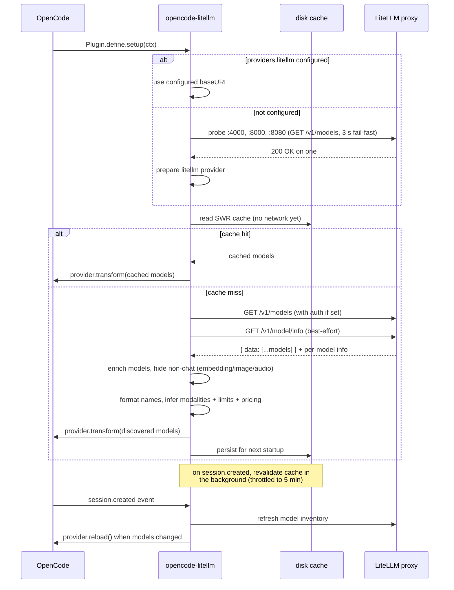

<div align="center">


# opencode-litellm

**Drop-in [LiteLLM](https://github.com/BerriAI/litellm) provider for [OpenCode](https://opencode.ai) with zero configuration.**

[](https://opencode.ai)
[](https://github.com/BerriAI/litellm)

[](https://www.npmjs.com/package/opencode-plugin-litellm)
[](https://www.npmjs.com/package/opencode-plugin-litellm)
[](https://github.com/yuseferi/opencode-litellm/actions/workflows/ci.yml)
[](./LICENSE)
[](./tsconfig.json)
[](./CONTRIBUTING.md)

Auto-detect a running LiteLLM proxy, pull every model from `/v1/models`, and register them in OpenCode.
**No model lists to hand-maintain. No restart loops. No surprises.**


[Quickstart](#-quickstart) · [Configuration](#%EF%B8%8F-configuration) · [How it works](#-how-it-works) · [FAQ](#-faq) · [Contributing](./CONTRIBUTING.md)

</div>

> **npm package:** `opencode-plugin-litellm` &nbsp;·&nbsp; **GitHub repo:** `yuseferi/opencode-litellm`
> The unscoped `opencode-litellm` npm name was already taken by another author.

---

## ✨ Why this plugin?

Maintaining a `models` block in `opencode.json` for every model your LiteLLM proxy exposes is a chore — every new entry in your `model_list` means a config edit, a restart, and a context-switch.

`opencode-litellm` removes that loop entirely. It queries your LiteLLM proxy during plugin setup and registers discovered models with OpenCode's provider registry. New models are refreshed in-process through the V2 provider API, while V1 keeps its config-hook behavior.

## 🚀 Quickstart

After a V2-compatible release is published, install the plugin from the CLI
and configure the shared background service. If your OpenCode 2 executable is
named `opencode2`, use it in place of `opencode` below.

```bash
opencode plugin add opencode-plugin-litellm
opencode service set env LITELLM_BASE_URL https://litellm.internal.example.com/v1
opencode service set env LITELLM_API_KEY YOUR_API_KEY
```

Then open OpenCode and select a discovered model under `litellm/...`.

> **RFC status:** OpenCode 2 support is not yet included in the published npm
> package. For now, `plugin add` installs the previous release, not this RFC
> implementation.

For a local LiteLLM proxy on port 4000, the base URL can be omitted and the
plugin will detect it automatically. The [configuration section](#%EF%B8%8F-configuration)
also shows how to configure a provider directly in `opencode.json`.

## 🎯 Features

| | |
|---|---|
| 🔍 **Auto-detection** | Probes `localhost:4000`, `:8000`, `:8080` and adopts the first responsive proxy. |
| 📡 **Dynamic discovery** | Queries `/v1/models` so your OpenCode model picker always reflects your live `model_list`. |
| ⚡ **Stale-while-revalidate** | A warm disk cache supplies models without a network request. New sessions trigger a background refresh, and cache entries expire after 7 days. |
| 🏷️ **Smart formatting** | Turns `anthropic/claude-3-5-sonnet` into `Claude 3.5 Sonnet` in the picker — handles versions, sizes, quantizations, and brand-cased names like `gpt-4o`. Set `formatModelNames: false` to keep the raw LiteLLM ids instead. |
| 🧠 **Modality-aware** | Enriches `/v1/models` entries with `/v1/model/info` (`mode`, token limits, capability flags) and hides embedding / image / audio models from the picker. |
| 💵 **Real pricing** | Maps `input_cost_per_token` / `output_cost_per_token` (and cache read/write costs) from `/v1/model/info` into OpenCode's `cost` field, so the picker and `/cost` show what the proxy actually bills instead of `$0.00`. Models LiteLLM has no price for are left unpriced, not falsely marked free. |
| 🧩 **Reasoning-effort variants** | When LiteLLM reports per-model effort support (`supports_low_reasoning_effort`, …), the plugin surfaces each level as a picker variant automatically. |
| 🔐 **Auth-aware** | Honours `LITELLM_API_KEY` / `LITELLM_MASTER_KEY`, `providers.litellm.settings.apiKey`, and OpenCode `/connect` credentials on the V1 server path. |
| 🌐 **Gateway-friendly** | Supports provider `headers` (and the legacy `customHeaders` option) for proxies behind Cloudflare Access or other API gateways. |
| 🧩 **Splittable catalog** | `includeModels` / `excludeModels` (glob patterns) let one LiteLLM proxy be divided into several OpenCode providers — e.g. by naming prefix — without hand-maintaining a model list. |
| 🎚️ **Capability overrides** | `modelCapabilities` forces or retracts per-model capability flags (`supports_vision`, `supports_function_calling`, …) when `/v1/model/info` is unavailable or disagrees with your deployment. |
| ⏱️ **Bounded startup** | Health checks fail fast (3 s); discovery fetches are capped at **15 s** (configurable via `LITELLM_REQUEST_TIMEOUT_MS`) for slow remote proxies. V2 model refresh runs in the background. |
| 📝 **OpenCode logging** | V1 logs go through OpenCode's log API; V2 logs use the V2 plugin host's console logging. |
| 🤝 **Non-destructive merge** | Only adds models you don't already have configured. Hand-curated entries are preserved verbatim. |
| 🔌 **V1 + V2** | Uses OpenCode 2's `Plugin.define`, provider transforms, and event subscription, with an OpenCode 1 server entrypoint for compatible V1 releases. |
| 🔒 **TypeScript strict** | Strict-mode compiled, fully typed public API. |

## ⚙️ Configuration

### Minimal config (recommended)

Point at your LiteLLM proxy — the plugin discovers all models automatically:

```jsonc
{
  "$schema": "https://opencode.ai/config.json",
  "plugins": ["opencode-plugin-litellm@latest"],
  "providers": {
    "litellm": {
      "name": "LiteLLM (proxy)",
      "package": "@opencode/ai/providers/openai-compatible",
      "settings": {
        "baseURL": "http://localhost:4000/v1"
      }
    }
  }
}
```

### Explicit provider (custom URL or auth)

You **do not need to list any models** — the plugin still discovers them from `/v1/models` automatically. Use this form only when you need to point at a non-default URL or pass an API key:

```jsonc
{
  "$schema": "https://opencode.ai/config.json",
  "plugins": ["opencode-plugin-litellm@latest"],
  "providers": {
    "litellm": {
      "name": "LiteLLM (proxy)",
      "package": "@opencode/ai/providers/openai-compatible",
      "settings": {
        "baseURL": "http://litellm.internal.example.com/v1",
        "apiKey": "{env:LITELLM_API_KEY}"
      }
    }
  }
}
```

That's the whole config — every model in your LiteLLM `model_list` will appear in the picker.

An explicit `settings.baseURL` in a LiteLLM provider takes precedence over
`LITELLM_BASE_URL`. If neither is set, the plugin checks the usual local ports.

### OpenCode 1.18.29+

The package also exposes the V1 server entrypoint for older OpenCode 1
installations. Keep the V1 `plugin` / `provider` configuration shape:

```jsonc
{
  "plugin": ["opencode-plugin-litellm@latest"],
  "provider": {
    "litellm": {
      "npm": "@ai-sdk/openai-compatible",
      "options": {
        "baseURL": "http://localhost:4000/v1"
      }
    }
  }
}
```

### Example: governed upstream route with Tuning Engines

If your team routes model traffic through Tuning Engines for policy, traces,
approvals, and usage visibility, add it as an OpenAI-compatible upstream in
your LiteLLM config. The plugin will discover the alias from LiteLLM just like
any other `model_list` entry:

```yaml
model_list:
  - model_name: te-gpt-5.4-mini
    litellm_params:
      model: openai/gpt-5.4-mini
      api_key: os.environ/TUNING_ENGINES_API_KEY
      api_base: https://api.tuningengines.com/v1
```

Then expose the key to LiteLLM and keep your OpenCode config pointed at the
same LiteLLM proxy:

```bash
export TUNING_ENGINES_API_KEY=sk-te-...
litellm --config config.yaml --port 4000
opencode
```

OpenCode and this plugin still own model discovery and picker wiring. Tuning
Engines sits on the upstream model route as the governed control plane.

### Overriding or curating individual models (optional)

If you want to rename a model in the picker or otherwise hand-curate metadata, add it under `models`. The plugin preserves your entries and only injects discovered models whose key isn't already defined:

```jsonc
{
  "providers": {
    "litellm": {
      "settings": {
        "baseURL": "http://litellm.internal.example.com/v1",
        "apiKey": "{env:LITELLM_API_KEY}"
      },
      "models": {
        "openai/gpt-4o": {
          "name": "GPT-4o (curated)"
        }
      }
    }
  }
}
```

Here, `openai/gpt-4o` keeps your custom name; every other model from the proxy is still discovered and added automatically.

### Reasoning models and effort variants

All discovered models — reasoning-tier included — register under your single
LiteLLM provider and are invoked through `/v1/chat/completions`.

If LiteLLM reports per-model reasoning-effort support (e.g.
`supports_low_reasoning_effort`, `supports_medium_reasoning_effort`,
`supports_high_reasoning_effort` in `model_info`), the plugin automatically
surfaces those as OpenCode variants under the discovered model. Each variant
sets `reasoningEffort` to the reported level, so you can switch between
effort levels from the model picker without hand-curating every entry.

> **Note**: OpenAI's reasoning-tier models (gpt-5, o1, o3, o4) reject
> requests that combine `reasoning_effort` with function tools on
> `/v1/chat/completions`. If you hit that error, fix it on the LiteLLM
> side — e.g. enable the Responses API for that model
> (`use_responses_api: true` in its `litellm_params`) — or leave
> `reasoningEffort` unset for that model in OpenCode. See the FAQ entry
> below.

### Authentication

If your LiteLLM proxy requires a master key, expose it via either approach:

| Method | Example |
|---|---|
| Env var (base URL) | `LITELLM_BASE_URL=https://litellm.internal.example.com/v1` |
| Env var | `export LITELLM_API_KEY=sk-...` |
| Env var (alias) | `export LITELLM_MASTER_KEY=sk-...` |
| Config | `"settings": { "apiKey": "{env:LITELLM_API_KEY}" }` |
| OpenCode `/connect` | Run `/connect`, search for your `litellm` provider entry, and paste the key |

The env var path lets you commit `opencode.json` without leaking secrets. On OpenCode 1, `/connect` credentials are read from OpenCode's auth store (`~/.local/share/opencode/auth.json`) and applied to health checks, model discovery, and completion-time requests. OpenCode 2 users can use `settings.apiKey` with an environment substitution or set `LITELLM_API_KEY` on the background service as shown in the Quickstart.

### Slow proxies (`LITELLM_REQUEST_TIMEOUT_MS`)

Each discovery request (`/v1/models`, `/v1/model/info`) is capped at 15 s by default. Proxies with many database-defined models — or a gateway in front of LiteLLM — can legitimately take longer. Raise the budget with:

```bash
export LITELLM_REQUEST_TIMEOUT_MS=60000
```

The overall discovery cap scales with it (max of 20 s and the request timeout + 5 s), so a slow proxy never blocks startup indefinitely but isn't cut off mid-flight either. Invalid values fall back to the default.

### Custom headers (Cloudflare Access, API gateways)

If your LiteLLM proxy is behind Cloudflare Access or another gateway that requires extra HTTP headers, use the provider's `headers` map:

```jsonc
{
  "providers": {
    "litellm": {
      "settings": {
        "baseURL": "https://litellm.internal.example.com/v1",
        "apiKey": "{env:LITELLM_API_KEY}"
      },
      "headers": {
        "CF-Access-Client-Id": "{env:CF_ACCESS_CLIENT_ID}",
        "CF-Access-Client-Secret": "{env:CF_ACCESS_CLIENT_SECRET}"
      }
    }
  }
}
```

These headers are included in every request the plugin makes during model discovery (health check and `/v1/models`). To obtain a Cloudflare Access Service Token, follow the [Cloudflare docs](https://developers.cloudflare.com/cloudflare-one/identity/service-tokens/).

### Splitting one proxy into multiple providers (`includeModels` / `excludeModels`)

If your LiteLLM catalog mixes naming conventions from different teams or environments (e.g. `prod/*` and `staging/*`), you can point two OpenCode providers at the *same* proxy and have each one surface only its slice:

```jsonc
{
  "providers": {
    "litellm": {
      "name": "Prod",
      "package": "@opencode/ai/providers/openai-compatible",
      "settings": {
        "baseURL": "http://localhost:4000/v1",
        "includeModels": ["prod/*"]
      }
    },
    "litellm-staging": {
      "name": "Staging",
      "package": "@opencode/ai/providers/openai-compatible",
      "settings": {
        "baseURL": "http://localhost:4000/v1",
        "includeModels": ["staging/*"],
        "excludeModels": ["staging/*-canary"]
      }
    }
  }
}
```

- `includeModels` is evaluated first — only ids matching at least one pattern are kept. Omit it to keep everything.
- `excludeModels` is evaluated after and always wins, even over `includeModels`.
- Patterns support only `*` (any run of characters); everything else is matched literally, so dots in ids like `gpt-4.1` need no escaping.
- Filtering happens before the on-disk cache is written, so each provider's cached view respects its own filters.
- Provider IDs beginning with `litellm-` are recognized automatically. Add `settings.litellm: true` to mark a provider with another ID.

### Correcting capability flags (`modelCapabilities`)

Model classification (tool-call badge, attachments, reasoning, input modalities) leans on the capability flags LiteLLM reports via `/v1/model/info`. If your proxy doesn't expose that endpoint, or reports a flag that doesn't match your deployment, override flags per model id:

```jsonc
{
  "providers": {
    "litellm": {
      "settings": {
        "baseURL": "http://localhost:4000/v1",
        "modelCapabilities": {
          "te-gpt-5.4-mini": { "supports_function_calling": true },
          "openai/gpt-4o": { "supports_vision": false }
        }
      }
    }
  }
}
```

- Overrides apply on top of whatever the proxy reports, with an explicit `false` winning — a flag the proxy never reported can be forced on just the same.
- Keys are exact model ids as they appear in `/v1/models` (not globs).
- Overridden flags flow into the picker exactly like natively reported ones, and the adjusted view is what gets persisted to the model cache.
- When `/v1/model/info` reports no modality flags, discovered chat models are registered as text-only. This avoids OpenCode's image-capable fallback for text-only deployments; set `supports_vision: true` explicitly for a route that has a working multimodal projector.
- Changing `modelCapabilities` (or `includeModels`/`excludeModels`) starts a fresh discovery on the next start — the cache is scoped by that config — so the picker reflects the new flags immediately.

### Keeping raw model ids in the picker (`formatModelNames`)

By default the plugin prettifies each discovered id into a display name — `anthropic/claude-3-5-sonnet` shows up as `Claude 3.5 Sonnet`. If you'd rather see your LiteLLM `model_list` aliases verbatim (for example because your team refers to models by those exact names, or the formatter mangles an internal naming scheme), turn formatting off:

```jsonc
{
  "providers": {
    "litellm": {
      "settings": {
        "baseURL": "http://localhost:4000/v1",
        "formatModelNames": false
      }
    }
  }
}
```

- The display name becomes the exact model id as returned by `/v1/models` (provider prefix, version suffixes and all). Nothing else changes — ids, capability flags, pricing and filtering behave exactly as before.
- Only a boolean `false` disables formatting; omitting the option or setting anything else keeps the default.
- Like the other options above, `formatModelNames` is part of the cache identity, so toggling it triggers a fresh discovery on the next start instead of serving previously cached names.
- To rename just a handful of models while keeping smart formatting for the rest, use the per-model `name` override described in [Overriding or curating individual models](#overriding-or-curating-individual-models-optional).

## 🔧 How it works



1. On OpenCode 2 startup the plugin's `setup` registers a provider transform. OpenCode 1 uses the legacy `config` hook.
2. If `providers.litellm` exists, its `settings.baseURL` is used. Otherwise common ports are probed — that probe is the only health check (3 s fail-fast per port).
3. With a configured `baseURL` the proxy is not contacted during startup unless the cache is cold; the discovery fetch itself fails fast if the proxy is unreachable.
4. **Fast path:** if a fresh on-disk cache exists (≤ 7 days old), its models are registered synchronously — startup does not wait on network discovery.
5. **Cold path:** `/v1/models` and `/v1/model/info` are fetched in parallel. Models are enriched with info metadata (`mode`, token limits, capability flags, per-token pricing — `/v1/models` omits these for database-defined models) and converted into OpenCode model entries with formatted `name`, inferred `modalities`, and `cost` (USD/1M tokens, converted from LiteLLM's USD/token). Non-chat models (embedding / image / audio) are excluded from the picker.
6. Discovered models are added alongside user-defined models — never overwriting them — and persisted to the cache.
7. On `session.created`, the cache is revalidated in the background (throttled to once per 5 minutes). V2 calls `provider.reload()` when the inventory changes; V1 surfaces refreshed entries on the next OpenCode start. The cold path is capped by a 20 s timeout.

> The earlier Desktop limitation applied to OpenCode 1's config-hook path. OpenCode 2 registers models through its provider registry transform.

## 📋 Requirements

- [OpenCode](https://opencode.ai) ≥ 2.0.14, or OpenCode 1.18.29+ for the legacy server entrypoint
- A running [LiteLLM](https://github.com/BerriAI/litellm) proxy:
  ```bash
  pip install 'litellm[proxy]'
  litellm --config config.yaml --port 4000
  ```
- Node.js ≥ 20 (or Bun ≥ 1.0)

## 📦 Compatibility matrix

| LiteLLM version | OpenCode version | Status |
|---|---|---|
| ≥ 1.40 | ≥ 2.0.14 or 1.18.29+ | ✅ Supported |
| 1.30 – 1.39 | ≥ 2.0.14 or 1.18.29+ | ⚠️ Should work (older `/v1/models` schema) |
| < 1.30 | any | ❌ Unsupported |

## ❓ FAQ

<details>
<summary><b>Why doesn't a model appear in OpenCode after I add it to LiteLLM?</b></summary>

Once LiteLLM exposes the model (restart or hot-reload LiteLLM if you edited
its `config.yaml`), the plugin picks it up automatically. OpenCode 2 refreshes
the provider registry when a new session triggers a changed inventory; OpenCode
1 serves the refreshed cache on the next start. To force an immediate refetch,
delete the cache directory (`~/.cache/opencode-litellm/`, or
`$XDG_CACHE_HOME/opencode-litellm/`).
</details>

<details>
<summary><b>Why do discovered models appear in the CLI but not OpenCode Desktop?</b></summary>

This was an OpenCode 1 config-hook limitation. OpenCode 2 registers discovered
models through the provider registry transform. If models are still missing in
OpenCode 2 Desktop, check the plugin log for provider discovery errors.
</details>

<details>
<summary><b>Can I use this with a remote LiteLLM proxy?</b></summary>

Yes. Set `providers.litellm.settings.baseURL` to your remote URL and optionally set `settings.apiKey`. Auto-detection only probes `localhost`, but explicit configuration works against any URL.
</details>

<details>
<summary><b>What happens if LiteLLM is offline at startup?</b></summary>

OpenCode starts normally either way. With a warm on-disk cache, the
previously discovered models are served from the cache — no network call —
so the picker works as usual; only the background refresh is skipped until
the proxy is back. With a cold cache (first run, or after the 7-day expiry),
the plugin logs a warning and you won't see LiteLLM-discovered models until
the proxy is reachable again.
</details>

<details>
<summary><b>Will my hand-curated model entries be overwritten?</b></summary>

No. The merge is additive: anything you've already defined under `providers.litellm.models` is preserved. Discovered models are only added if their key isn't already present.
</details>

<details>
<summary><b>Why is the npm name <code>opencode-plugin-litellm</code> and not <code>opencode-litellm</code>?</b></summary>

The unscoped `opencode-litellm` was already published by another author when this project was started. The GitHub repo and exported plugin symbol still use the cleaner `opencode-litellm` name.
</details>

<details>
<summary><b>Does this work with Ollama through LiteLLM?</b></summary>

Yes — anything in your LiteLLM `model_list` shows up, including Ollama, Bedrock, Azure, OpenAI, Anthropic, Google, etc. That's the whole point of LiteLLM.
</details>

<details>
<summary><b>My LiteLLM proxy is behind Cloudflare Access — how do I authenticate?</b></summary>

Cloudflare Access intercepts requests before they reach LiteLLM, so a plain `Authorization: Bearer` header isn't enough. Create a [Cloudflare Access Service Token](https://developers.cloudflare.com/cloudflare-one/identity/service-tokens/) and pass the credentials via `providers.litellm.headers`:

```jsonc
{
  "providers": {
    "litellm": {
      "package": "@opencode/ai/providers/openai-compatible",
      "settings": {
        "baseURL": "https://litellm.your-company.com/v1"
      },
      "headers": {
        "CF-Access-Client-Id": "{env:CF_ACCESS_CLIENT_ID}",
        "CF-Access-Client-Secret": "{env:CF_ACCESS_CLIENT_SECRET}"
      }
    }
  }
}
```

The `customHeaders` map works for any gateway that requires extra HTTP headers — not just Cloudflare.
</details>

<details>
<summary><b>I get <code>Function tools with reasoning_effort are not supported … in /v1/chat/completions</code> — what do I do?</b></summary>

This error comes from OpenAI: their reasoning-tier models (gpt-5, o1, o3, o4) refuse function-tool calls on `/v1/chat/completions` when `reasoning_effort` is set. The plugin registers every discovered model through the chat-completions path, so fix this on the LiteLLM side:

- Enable the Responses API for that model in your LiteLLM config (e.g. `use_responses_api: true` in its `litellm_params`), or
- Leave the model's `reasoningEffort` unset in OpenCode (don't pick a reasoning-effort variant for it).

If your model id doesn't look like a reasoning model to LiteLLM (e.g. you renamed it), also check that its `model_info` in `litellm config.yaml` carries the right `supports_*` flags.
</details>

## 🛠️ Development

```bash
git clone https://github.com/yuseferi/opencode-litellm.git
cd opencode-litellm
npm install
npm run typecheck
npm test
```

The project is intentionally tiny:

```
src/
├── index.ts                    # Public exports
├── types/index.ts              # LiteLLM API types
├── utils/
│   ├── litellm-api.ts          # health check, discovery (/v1/models + /v1/model/info), auto-detect
│   ├── format-model-name.ts    # name formatting, categorization
│   ├── model-cache.ts          # stale-while-revalidate on-disk model cache
│   ├── model-filter.ts         # includeModels/excludeModels glob filtering
│   ├── model-capabilities.ts   # per-model capability flag overrides
│   └── opencode-auth.ts        # fallback to OpenCode's /connect-stored credentials
└── plugin/
    ├── index.ts                # OpenCode 1 server entry and shared discovery logic
    └── v2.ts                   # OpenCode 2 definition, provider transform, event-driven reload

test/                           # vitest suite for the pure logic
```

See [`CONTRIBUTING.md`](./CONTRIBUTING.md) for the full contributor workflow.

## 🗺️ Roadmap

- [ ] Optional cost/latency overlay using LiteLLM's `/spend` and `/health` endpoints
- [ ] `chat.params` hook for injecting LiteLLM routing tags / fallbacks

Have an idea? [Open an issue](https://github.com/yuseferi/opencode-litellm/issues/new).

## 🙏 Acknowledgements

Inspired by [`opencode-lmstudio`](https://github.com/agustif/opencode-lmstudio) by [@agustif](https://github.com/agustif) — the architectural blueprint for OpenCode model-discovery plugins.

Built on top of [LiteLLM](https://github.com/BerriAI/litellm) by the [BerriAI](https://github.com/BerriAI) team and [OpenCode](https://opencode.ai) by the OpenCode contributors.

## 📄 License

[MIT](./LICENSE) © [Yusef Mohamadi](https://github.com/yuseferi)

---

<div align="center">

If this project saved you time, consider giving it a ⭐ on [GitHub](https://github.com/yuseferi/opencode-litellm).

</div>
